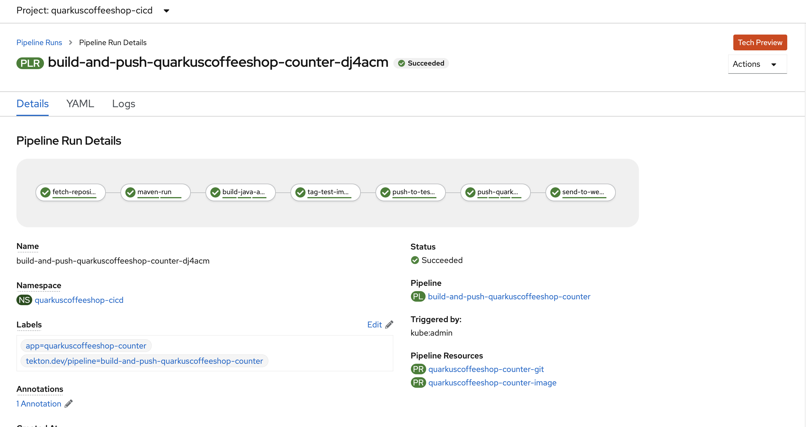

## quarkuscoffeeshop-counter tekton pipeline


**configure pvc**
```
oc -n quarkuscoffeeshop-cicd create -f quarkuscoffeeshop-counter/pvc/pvc.yml
oc -n quarkuscoffeeshop-cicd create -f  ./quarkuscoffeeshop-counter/pvc/maven-source-pvc.yml
```

**configure Tasks**
```
oc -n quarkuscoffeeshop-cicd create -f ./common-functions/tasks/git-clone.yaml
oc -n quarkuscoffeeshop-cicd create -f ./common-functions/tasks/openshift-client-task.yaml
oc -n  quarkuscoffeeshop-cicd create -f ./common-functions/tasks/maven.yaml
```

**Configure push image to quay task**
```
export QUAY_URL=
sed "s/{QUAY_URL}/$QUAY_URL/" ./quarkuscoffeeshop-counter/tektontasks/pushImageToQuay.yaml | oc -n  quarkuscoffeeshop-cicd create -f -
```

**configure Resources**
```
oc -n quarkuscoffeeshop-cicd create -f  ./quarkuscoffeeshop-counter/resources/git-pipeline-resource.yaml
oc -n quarkuscoffeeshop-cicd create -f  ./quarkuscoffeeshop-counter/resources/image-pipeline-resource.yaml
```

**Create Pipeline**

```
export QUAY_URL=
sed "s/{QUAY_URL}/$QUAY_URL/" ./quarkuscoffeeshop-counter/pipeline/deploy-pipeline.yaml | oc -n  quarkuscoffeeshop-cicd create -f -
```


### Integration testing instructions
```
oc adm policy add-role-to-user admin system:serviceaccount:quarkuscoffeeshop-demo:pipeline -n quarkuscoffeeshop-cicd
oc policy add-role-to-group system:image-puller system:serviceaccounts:quarkuscoffeeshop-demo -n quarkuscoffeeshop-cicd
oc adm policy add-role-to-user admin system:serviceaccount:quarkuscoffeeshop-cicd:pipeline -n quarkuscoffeeshop-demo

oc project quarkuscoffeeshop-demo
oc create -f application-deployment/store/quarkuscoffeeshop-counter/quarkuscoffeeshop-counter.yaml  -n quarkuscoffeeshop-demo
```

**Update Enviornment Variables in deployment**
```
oc edit deployment.apps/quarkuscoffeeshop-counter
```
